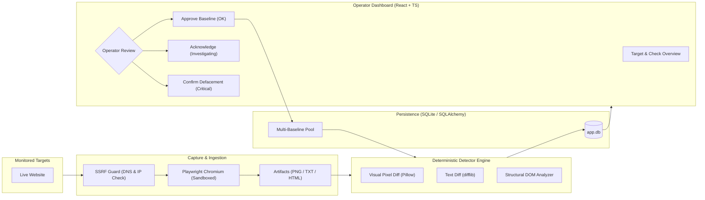

# Web Defacement Monitoring System

An automated, deterministic website integrity and unauthorized change detection platform. The system periodically captures high-fidelity browser snapshots of monitored web targets, extracts visible text, full-page screenshots, and structural DOM metadata, and compares them against verified, operator-approved reference baselines (**Baseline Snapshots**).

---

## Key Features

- **Deterministic Multi-Detector Engine:**
  - **Visual / Pixel Diffing:** High-speed channel difference analysis using Pillow C-extensions. Normalizes dynamic height changes and computes visual change scores (`visual_change_score`).
  - **Text Diffing:** Granular text difference analysis powered by `difflib.SequenceMatcher`, with an adaptive scaling strategy switching to line-level diffing on large documents (>100 KB).
  - **Structural & Script Injection Detection:** Inspects DOM structures, detects hidden iframes, rogue external scripts, form action repointing, and malicious meta refresh tags, with domain allowlisting support.
- **Fail-Safe Headless Browser Rendering:**
  - Full client-side JavaScript execution via Playwright Chromium.
  - Enforced browser sandbox isolation policy (`chromium_sandbox`) to securely handle untrusted external web content.
- **Multi-Baseline Management & Smart Selection:**
  - Supports multiple valid baselines per target (e.g. seasonal promotions, localized variations).
  - Dynamic matching selects the closest matching baseline to minimize false positives while honoring strict retention caps (`max_baselines_per_target`).
- **Security-First Architecture:**
  - **SSRF Guard:** Pre-flight DNS resolution and IP validation blocking private CIDR ranges (RFC 1918), loopback, link-local, and IPv6 mapped addresses, with DNS rebinding protection.
  - **Local Authentication:** Cookie-based session authentication (`HttpOnly`, `SameSite=Lax`), Argon2id password hashing, and progressive brute-force rate-limiting and account lockout.
  - **Concurrency Control:** In-flight check deduplication and guards preventing target URL alterations during active check execution (HTTP 409 Conflict).
- **Operator Dashboard:**
  - Modern React 18 + TypeScript SPA with dark mode styling (Tailwind CSS).
  - **3-Panel Visual Diff Heatmap:** Side-by-side comparison (Baseline, Canvas Heatmap, Current) with interactive click-to-zoom modals.
  - **Real-Time Polling & Cache Reactivity:** Instant synchronization with background scheduler checks via TanStack Query.
  - **Server-Side Pagination:** Scalable target listing with pagination controls and accurate database counts.

---

## System Architecture



---

## Tech Stack

| Layer | Technology | Description |
| :--- | :--- | :--- |
| **Backend** | **FastAPI** (Python 3.11+) | Async REST API, Pydantic v2 schemas, Dependency Injection |
| **Headless Browser** | **Playwright** (Chromium) | Full-page captures, visible text, rendered HTML DOM |
| **Database & ORM** | **SQLite / SQLAlchemy 2.0** | Relational storage, Alembic migrations, explicit session flush safety |
| **Image & Text Processing** | **Pillow (PIL) & difflib** | Channel arithmetic, image histogram diffing, adaptive text diffing |
| **Frontend** | **React 18 + TypeScript + Vite** | High-performance SPA with client-side canvas processing |
| **Data Fetching** | **TanStack Query (React Query v5)** | Cache management, signature-based reactivity, polling synchronization |
| **Styling** | **Tailwind CSS + Lucide Icons** | Responsive modern Slate dark mode |
| **Testing & Quality** | **Pytest, Ruff, Mypy, Vitest** | Strict typing, full test coverage across backend and frontend |

---

## Getting Started

### Prerequisites

- **Python:** 3.11 or higher
- **Node.js:** 20 or higher
- **Playwright:** Chromium browser binaries installed (`playwright install chromium`)
- *(Optional)* **Docker & Docker Compose**

---

### Option A: Running with Docker Compose

1. Copy environment variables for backend and frontend:
   ```bash
   cp backend/.env.example backend/.env
   cp frontend/.env.example frontend/.env
   ```

2. Start the services:
   ```bash
   docker compose up --build
   ```

3. Open the dashboard at `http://localhost:3000` (Backend runs at `http://localhost:8000`).

---

### Option B: Local Manual Setup

#### 1. Backend Setup

```bash
cd backend

# Create and activate a virtual environment
python -m venv .venv
source .venv/bin/activate  # On Windows: .venv\Scripts\activate

# Install dependencies
pip install -r requirements.txt -r requirements-dev.txt

# Install Playwright browser dependencies
playwright install chromium

# Copy environment configuration
cp .env.example .env

# Run database migrations
alembic upgrade head

# Bootstrap the initial admin user (interactive prompt)
python scripts/create_user.py

# Start the development server
uvicorn app.main:app --host 0.0.0.0 --port 8000 --reload
```

#### 2. Frontend Setup

```bash
cd frontend

# Install npm dependencies
npm install

# Copy environment configuration
cp .env.example .env

# Start the development server
npm run dev
```

Visit `http://localhost:5173` to access the dashboard and log in with your bootstrap admin credentials.

---

## Running Verification & Test Suites

### Backend Tests & Static Analysis

From the project root:

```bash
# Run pytest test suite (123 tests)
pytest backend/tests -v

# Run linter
ruff check backend

# Run strict static type checking
cd backend
mypy app
```

### Frontend Tests, Linting & Production Build

From the `frontend` directory:

```bash
cd frontend

# Run unit and component test suites (61 tests)
npm run test

# Run linter
npm run lint

# Compile production bundle and typecheck
npm run build
```

---

## Project Structure

```text
Web Defacement Project/
├── backend/                      # FastAPI backend application
│   ├── alembic/                  # Database migration scripts
│   ├── app/
│   │   ├── api/routes/           # API endpoints (auth, targets, checks, snapshots, review, config)
│   │   ├── core/                 # Settings, SSRF guard, security, status machine, errors
│   │   ├── db/                   # SQLAlchemy database engine and sessionmakers
│   │   ├── models/               # ORM Models (Target, Snapshot, CheckResult, User, Session)
│   │   ├── schemas/              # Pydantic validation schemas
│   │   └── services/
│   │       ├── capture/          # Playwright snapshot capture engine
│   │       ├── diff/             # Pixel, text, and structural diff engines
│   │       ├── checks.py         # Check pipeline execution and state transitions
│   │       ├── concurrency.py    # Semaphore and per-domain bounded execution
│   │       └── review.py         # Baseline promotion and acknowledgment logic
│   ├── data/                     # Local artifact storage (screenshots, text, HTML)
│   ├── scripts/                  # Administrative tools (create_user.py, smoke_test.py)
│   └── tests/                    # Pytest test suite
├── frontend/                     # React 18 TypeScript frontend
│   ├── src/
│   │   ├── api/                  # API client modules
│   │   ├── components/           # UI components (ScreenshotCompare, TextDiffView, Modals)
│   │   ├── hooks/                # React Query hooks (useTargets, useTargetDetail, useAuth)
│   │   ├── pages/                # Views (LoginPage, TargetListPage, TargetDetailPage, CheckDetailPage)
│   │   └── types/                # TypeScript interface definitions
│   └── src/pages/*.test.tsx      # Vitest component test suites
├── plan/                         # Engineering plans and architectural specifications
│   ├── PROJECT_PLAN.md           # Master roadmap and current stage status
│   └── archive/                  # Historical planning documents and reviews
├── refinement/                   # Detailed engineering and refinement records
│   ├── 22-7-2026/                # Early architecture and diffing specifications
│   ├── 3-9-2026/                 # Stage 1 implementation and baseline management
│   ├── 4-9-2026/                 # Defaced status and operator actions
│   ├── 7-9-2026/                 # Soak test reset, overflow fixes, edit & delete
│   └── 8-9-2026/                 # Critical code review remediation (CR-01 to CR-06)
├── docker-compose.yml            # Local container orchestration
└── README.md                     # This file
```

---

## License

Internal proprietary software developed for Website Defacement Monitoring and Infrastructure Integrity Protection.
