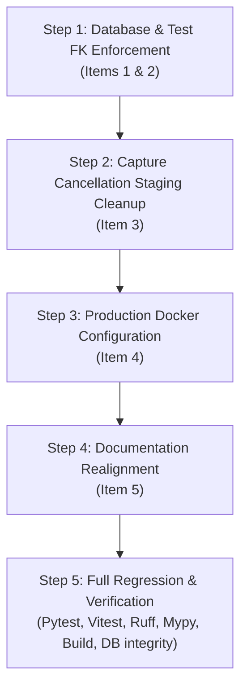

# CR10 Follow-up Implementation Plan

**Date:** September 17, 2026  
**Document Name:** `CR10-Follow-up-Implementation-Plan-17-9-2026.md`  
**Authoritative Source:** [`plan/CR10-Follow-up-Remediation-Plan-17-9-2026.md`](CR10-Follow-up-Remediation-Plan-17-9-2026.md)  
**Parent Plan:** [`plan/PROJECT_PLAN.md`](PROJECT_PLAN.md)  
**Status:** **Approved for Execution**  

---

## 1. Executive Summary & Design Alignments

This document establishes the technical implementation blueprint for resolving the five follow-up findings identified during the CR10 post-review. All decisions were aligned through interactive design review:

1. **Transaction Ordering & Foreign Keys (Item 1 & 2 / P1)**: Explicit `db.flush()` on `Snapshot` prior to `CheckResult` insertion inside the same atomic transaction; `db.rollback()` and promoted artifact cleanup on commit failure; `PRAGMA foreign_keys = ON` attached to all test engines with regression tests.
2. **Capture Staging Cleanup Lifecycle (Item 3 / P2)**: `capture_page` guarantees its own staging cleanup if execution is aborted or cancelled before returning `CaptureResult`.
3. **Production Docker Configuration (Item 4 / P3)**: Multi-stage Dockerfile using Nginx Alpine to serve `dist/` with caching headers and SPA fallback; removal of `--reload` from production backend compose; creation of `docker-compose.dev.yml` for development.
4. **Documentation Realignment (Item 5 / P2)**: Realignment of CR10-08 through CR10-12 numbering, migration filename correction to `d2b3c4e5f6a7_structural_detector.py`, and updating `UPDATE_SUMMARY.md`.

---

## 2. Strict Operational Invariants

- **Production Database Preservation**: `backend/data/app.db` contains two active monitoring targets (*Bangkok Chain Hospital* and *World Medical Hospital TH*). It must never be reset, cleared, or used directly in automated tests.
- **Single API Worker**: Uvicorn concurrency model remains `--workers 1` with process-local atomic in-flight reservation.
- **Fail-Closed Security**: SSRF guard, CSRF validation, session authentication, and threshold detectors remain fully intact.

---

## 3. Detailed Component Implementation

### 3.1 Item 1: Transaction Flush Ordering & Failure Cleanup
- **File:** `backend/app/services/checks.py`
- **Actions:**
  1. In `run_target_check`, when `has_changes` is True:
     ```python
     db.add(snapshot)
     db.flush()  # Ensures snapshot is written so CheckResult.current_snapshot_id FK is valid
     check_result = CheckResult(
         target_id=target.id,
         baseline_snapshot_id=matched_baseline_id,
         current_snapshot_id=snapshot.id,
         status=STATUS_CHANGED,
         ...
     )
     transition_target(target, STATUS_CHANGED)
     db.add(check_result)
     db.commit()
     ```
  2. In failure handling:
     ```python
     except Exception as exc:
         db.rollback()
         if artifacts_promoted:
             _cleanup_promoted_files(snapshot)
         ...
     ```

### 3.2 Item 2: Test Suite Foreign Key Activation & Regression Tests
- **Files:** `backend/tests/conftest.py`, `backend/tests/test_checks.py`
- **Actions:**
  1. Attach connection listener to test engines in `conftest.py`:
     ```python
     @event.listens_for(engine, "connect")
     def set_sqlite_pragma(dbapi_connection, connection_record):
         cursor = dbapi_connection.cursor()
         cursor.execute("PRAGMA foreign_keys=ON")
         cursor.close()
     ```
  2. Add regression tests in `test_checks.py`:
     - Test baseline -> detect changes -> save `Changed` under active foreign keys.
     - Test foreign key violation on invalid `current_snapshot_id`.
     - Test foreign key protection preventing orphan deletion.

### 3.3 Item 3: Capture Staging Directory Cleanup on Cancellation
- **File:** `backend/app/services/capture/capture.py`
- **Actions:**
  1. Track `capture_succeeded = False` and `staging_dir: Path | None = None`.
  2. Implement double `finally:` block:
     ```python
     finally:
         try:
             await browser.close()
         finally:
             if not capture_succeeded and staging_dir is not None and staging_dir.exists():
                 shutil.rmtree(staging_dir, ignore_errors=True)
     ```
  3. Ensure `asyncio.CancelledError` propagates without being suppressed.
  4. Add unit test in `backend/tests/test_capture.py` simulating cancellation during browser shutdown.

### 3.4 Item 4: Production Container Multi-stage Strategy
- **Files:** `frontend/Dockerfile`, `frontend/nginx.conf`, `docker-compose.yml`, `docker-compose.dev.yml`, `README.md`
- **Actions:**
  1. Create `frontend/Dockerfile` (Stage 1: node:20-slim build; Stage 2: nginx:alpine).
  2. Create `frontend/nginx.conf` with gzip, cache headers, and `/api/` reverse proxy.
  3. Update `docker-compose.yml` for production (no `--reload` in backend, built frontend image).
  4. Create `docker-compose.dev.yml` for developer convenience.
  5. Update `README.md` with operational guidance.

### 3.5 Item 5: Documentation Realignment & Tracking
- **Files:** `refinement/17-9-2026/Code-Review-Remediation-CR10-Phase3-17-9-2026.md`, `UPDATE_SUMMARY.md`
- **Actions:**
  1. Realign CR10-08 to CR10-12 numbers to strictly match `plan/Code-Review-and-Remediation-Plan-CR10-17-9-2026.md`.
  2. Correct migration filename reference to `d2b3c4e5f6a7_structural_detector.py`.
  3. Update `UPDATE_SUMMARY.md` documenting schema review and stamping.

---

## 4. Phased Execution & Verification Workflow



---

## 5. Acceptance Criteria Checklist

- [ ] SQLite test engine runs with `PRAGMA foreign_keys=ON` and catches any topological insert faults.
- [ ] Storing `Changed` check result succeeds cleanly without `FOREIGN KEY constraint failed`.
- [ ] Immediate cancellation during capture cleans up temporary `staging/` files.
- [ ] `docker compose up` uses production multi-stage frontend with Nginx and non-reload backend.
- [ ] `docker compose -f docker-compose.dev.yml up` remains functional for development.
- [ ] All 143+ backend pytests, 70 frontend vitest tests, linters, and type checkers pass 100%.
- [ ] `backend/data/app.db` data and targets remain 100% untouched.
