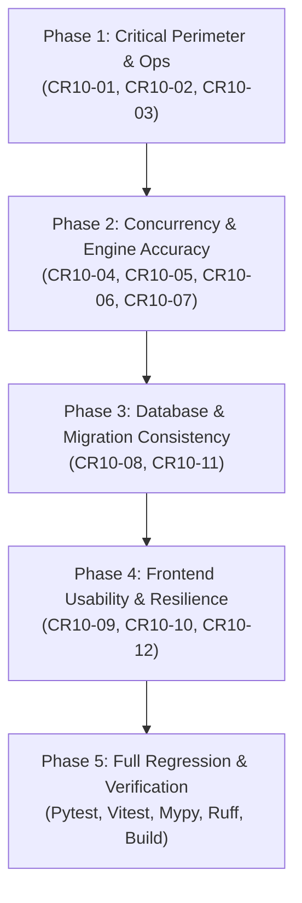

# Code Review and Remediation Plan (CR10) — September 17, 2026

**Date:** September 17, 2026  
**Project:** Website Defacement Monitoring System (`Web Defacement Project Linux`)  
**Status:** Plan Proposed — Awaiting Approval  
**Prior Cycles:**
- [CR-01 to CR-06 Remediation Record (8-9-2026)](../refinement/8-9-2026/Code-Review-Remediation-CR01-to-CR06-8-9-2026.md)
- [Code Review by GPT-6 Astra (9-9-2026)](Code%20Review%20by%20GPT6%20Astra%209-9-2026.md)
- [Code Review Completion Plan CR09 (10-9-2026)](Code-Review-Completion-Plan-CR09-10-9-2026.md)
- [CR09 Completion Record (10-9-2026)](../refinement/10-9-2026/Code-Review-Completion-CR09-10-9-2026.md)
**Master Project Plan:** [PROJECT_PLAN.md](PROJECT_PLAN.md)  
**Target Environment:** Ubuntu Server / Docker Compose Deployment (`10.117.10.68`)  

---

## 1. Scope, Invariants, and Operational Constraints

This remediation cycle (designated **CR10**) addresses twelve (12) technical findings identified during the comprehensive code review conducted on September 17, 2026. It establishes concrete remediation specifications, test fixtures, and verification criteria for backend security boundaries, concurrency management, diff engine parsing, database consistency, operational runtime configuration, and frontend usability.

### Strict Operational Invariants (Must Be Preserved)
1. **Preserve Production Data & Soak Test:**
   - Under no circumstances shall `backend/data/app.db` or its historical records be deleted or cleared.
   - The two active target monitors (*Bangkok Chain Hospital* and *World Medical Hospital TH*) must remain intact in their preserved state.
   - Stored baseline snapshots and check results must not be altered, deleted, or reset.
2. **Single API Worker Architecture:**
   - Retain the single API worker model (`--workers 1`). Concurrency control and in-flight tracking remain process-local in accordance with the current architecture.
3. **Security Perimeter Integrity:**
   - Session authentication, CSRF synchronizer token verification, rate limiting, service worker blocking, WebSocket blocking, and per-capture loopback proxy validation introduced in CR09-01 must remain strictly active and unchanged.
4. **No Artificial Threshold Weakening:**
   - Detector thresholds (`TEXT_CHANGE_THRESHOLD=0.02`, `VISUAL_CHANGE_THRESHOLD=0.01`, `STRUCTURE_CHANGE_THRESHOLD=0.0`) must not be modified to force test passes or mask partial comparisons.
5. **Separation of Concerns:**
   - All regression testing must use isolated temporary directories, in-memory or fixture databases, and mock network endpoints. No tests may communicate with live production targets or internal network IPs.

---

## 2. Baseline Verification Environment

Prior to remediation, the source tree was verified in the Windows testing environment with the following results:
- **Python Runtime:** Python 3.13.7, Pytest 9.1.1, AnyIO 4.15.0, Playwright 1.48.0
  - **Backend Test Suite:** `137 passed, 1 warning in 43.34s`
  - **Ruff:** `All checks passed!`
  - **Mypy:** `Success: no issues found in 47 source files`
- **Node.js Runtime:** Node.js 24.7.0, npm 11.5.1, TypeScript 5.6.3, Vitest 4.1.9, Vite 5.4.21, ESLint 9.13.0
  - **Frontend Test Suite:** `11 test files, 67 passed in 19.32s`
  - **TypeScript:** `tsc -b` compiled with zero diagnostics
  - **ESLint:** Zero warnings and zero errors
  - **Production Build:** `vite build` generated 1,494 modules into `frontend/dist`

---

## 3. Findings Matrix & Classification

| ID | Priority | Category | Component / File | Problem Statement |
|---|---|---|---|---|
| **CR10-01** | **P1 (High)** | Security / SSRF | `backend/app/core/ssrf_guard.py` | `is_blocked_address` omits RFC 6598 CGNAT (`100.64.0.0/10`) and benchmarking (`198.18.0.0/15`), allowing connections to cloud/overlay infrastructure. |
| **CR10-02** | **P1 (High)** | Stability / Ops | `docker-compose.yml` | `uvicorn --reload` watches the mounted volume containing active capture storage (`/app/data`), triggering mid-check worker restarts (`STALE_CHECK_ERROR`). |
| **CR10-03** | **P1 (High)** | Security / Path | `backend/app/api/routes/snapshots.py` | `/snapshots/{id}/screenshot` and `/snapshots/{id}/text` lack path containment verification against `settings.DATA_DIR`. |
| **CR10-04** | **P2 (Medium)** | Concurrency | `backend/app/api/routes/checks.py`, `backend/app/services/concurrency.py` | `trigger_target_check` returns before `_in_flight_targets` is updated, creating a race window for duplicate manual/scheduled checks. |
| **CR10-05** | **P2 (Medium)** | Resource Leak | `backend/app/services/checks.py` | Check timeouts raise `asyncio.CancelledError` (`BaseException`), bypassing `except Exception` and leaving staging folders uncleaned. |
| **CR10-06** | **P2 (Medium)** | Data Integrity | `backend/app/db/session.py` | SQLite connection handler omits `PRAGMA foreign_keys = ON`, disabling referential integrity enforcement. |
| **CR10-07** | **P2 (Medium)** | Detection Engine| `backend/app/services/diff/structure.py` | `_StructureParser.handle_data` appends raw streaming chunks rather than complete `<script>` bodies, producing arbitrary hash fragments. |
| **CR10-08** | **P2 (Medium)** | Database / Migrations | `backend/alembic/`, `backend/data/app.db` | Live database `app.db` was created via `Base.metadata.create_all()` and lacks the `alembic_version` table; future `alembic upgrade` will fail. |
| **CR10-09** | **P3 (Low)** | Frontend UX | `frontend/src/pages/TargetDetailPage.tsx` | Triage action buttons remain clickable during `Checking` and log failures silently to `console.error` when rejected with HTTP 409 Conflict. |
| **CR10-10** | **P3 (Low)** | Frontend UX | `frontend/src/pages/TargetDetailPage.tsx` | Target Detail Page lacks an on-demand "Run Check" action, forcing operators back to the dashboard to trigger manual checks. |
| **CR10-11** | **P3 (Low)** | I18N / Encoding | `backend/app/api/routes/snapshots.py` | `GET /snapshots/{id}/text` sets `Content-Type: text/plain` without `charset=utf-8`, causing encoding degradation for Thai text. |
| **CR10-12** | **P3 (Low)** | Deployment / Ops| `docker-compose.yml` | Frontend container runs `npm run dev` in production instead of serving optimized static bundles. |

---

## 4. Detailed Remediation Specifications

### 4.1 CR10-01: SSRF Boundary Hardening for Cloud & CGNAT Networks
- **Root Cause:** Standard Python `ipaddress.IPv4Address.is_private` only matches RFC 1918 (`10.0.0.0/8`, `172.16.0.0/12`, `192.168.0.0/16`). RFC 6598 Shared Address Space (`100.64.0.0/10`) evaluates to `is_private=False` and `is_reserved=False`. Because cloud providers (AWS VPC CNI, GCP, Kubernetes overlays, Tailscale) use this range for internal routing, it represents an SSRF exposure vector.
- **Remediation Steps:**
  1. In `backend/app/core/ssrf_guard.py`, define explicit reserved subnets:
     ```python
     BLOCKED_SPECIAL_NETWORKS = (
         ipaddress.ip_network("100.64.0.0/10"),   # RFC 6598 Shared Address Space / CGNAT
         ipaddress.ip_network("198.18.0.0/15"),   # RFC 2544 Network Interconnect Device Benchmark
     )
     ```
  2. Update `is_blocked_address(ip: IPAddress) -> bool`:
     - If IPv6 and `ip.ipv4_mapped` exists, unpack mapped IPv4.
     - Evaluate standard attributes (`is_private`, `is_loopback`, `is_link_local`, `is_reserved`, `is_multicast`, `is_unspecified`).
     - Check membership against `BLOCKED_SPECIAL_NETWORKS`.
  3. Update module docstring in `ssrf_guard.py` to remove obsolete claims about validation-to-connection DNS rebinding, noting that per-capture `SsrfProxy` enforces this at socket connection time.
- **Acceptance Criteria:**
  - `is_blocked_address(ipaddress.ip_address("100.64.0.1"))` returns `True`.
  - `is_blocked_address(ipaddress.ip_address("100.127.255.254"))` returns `True`.
  - `is_blocked_address(ipaddress.ip_address("198.18.0.1"))` returns `True`.
  - Public IPs (e.g. `1.1.1.1`, `8.8.8.8`) return `False`.
  - `validate_url` and `SsrfProxy` reject resolutions pointing to `100.64.0.0/10` with `SsrfBlockedError`.

---

### 4.2 CR10-02: Eliminate Uvicorn File Watcher Reload Loop
- **Root Cause:** `docker-compose.yml` invokes Uvicorn with `--reload` while `./backend:/app` is volume-mounted. When `run_target_check` stores captures in `/app/data/screenshots`, updates `/app/data/html`, or SQLite writes WAL pages (`app.db-wal`), `watchfiles` detects file modifications and triggers a process restart, causing target checks to fail with `STALE_CHECK_ERROR`.
- **Remediation Steps:**
  1. In `docker-compose.yml`, modify the backend command:
     - For production / stage-2 testing: Remove `--reload`.
     - For local development workflows: Restrict reload directory explicitly: `--reload-dir app`.
  2. Add documentation in `README.md` explaining why `--reload` must not watch `/app/data/`.
- **Acceptance Criteria:**
  - Running a capture that writes artifacts to `backend/data/screenshots/` does not restart the Uvicorn process.
  - No `STALE_CHECK_ERROR` entries are generated during sequential or concurrent checks.

---

### 4.3 CR10-03: Strict Path Containment on Artifact Retrieval Endpoints
- **Root Cause:** In `backend/app/api/routes/snapshots.py`, `get_snapshot_screenshot` and `get_snapshot_text` instantiate `Path(snapshot.screenshot_path)` without verifying that the resolved path is located within the authorized data directory.
- **Remediation Steps:**
  1. Introduce a helper function `_resolve_contained_artifact(raw_path: str, base_dir: Path) -> Path`:
     ```python
     def _resolve_contained_artifact(raw_path: str, base_dir: Path) -> Path:
         resolved_base = base_dir.resolve()
         resolved_file = Path(raw_path).resolve()
         if not resolved_file.is_relative_to(resolved_base) or not resolved_file.is_file():
             raise NotFoundError("Artifact file not found or inaccessible")
         return resolved_file
     ```
  2. Apply `_resolve_contained_artifact` in `get_snapshot_screenshot` and `get_snapshot_text`.
- **Acceptance Criteria:**
  - Valid paths under `DATA_DIR/screenshots` and `DATA_DIR/text` serve correctly.
  - Paths resolving outside `DATA_DIR` (e.g. `../../etc/passwd`, `C:\Windows\...`) raise `NotFoundError` (HTTP 404), never exposing unauthorized filesystem assets.

---

### 4.4 CR10-04: Atomic Reservation for In-Flight Check Triggers
- **Root Cause:** In `trigger_target_check` (`routes/checks.py`), the check for `is_target_in_flight(target_id)` occurs before `background_tasks.add_task(...)`. The target ID is added to `_in_flight_targets` only when `run_checks_for_targets` runs *after* the response has been returned. Rapid double-clicks or concurrent API requests both pass the guard, causing silent background discards and potential scheduler collisions.
- **Remediation Steps:**
  1. In `backend/app/services/concurrency.py`, provide atomic reservation primitives:
     ```python
     def try_acquire_in_flight(target_id: str) -> bool:
         if target_id in _in_flight_targets:
             return False
         _in_flight_targets.add(target_id)
         return True

     def release_in_flight(target_id: str) -> None:
         _in_flight_targets.discard(target_id)
     ```
  2. Update `trigger_target_check` to acquire reservation synchronously:
     ```python
     if target.status == STATUS_CHECKING or not try_acquire_in_flight(target_id):
         return CheckTriggerResponse(target_id=target_id, accepted=False)
     ```
  3. Ensure `run_checks_for_targets` coordinates with already-acquired reservations so manual and scheduled check entries do not conflict.
- **Acceptance Criteria:**
  - Two immediate concurrent calls to `POST /targets/{id}/check` result in the first returning `accepted: True` and the second returning `accepted: False`.
  - In-flight targets are consistently released upon completion, failure, timeout, or cancellation.

---

### 4.5 CR10-05: Guaranteed Staging Artifact Cleanup on Cancellation
- **Root Cause:** In `run_target_check` (`checks.py`), error handling uses `except Exception as exc:`. When `asyncio.wait_for(...)` expires, Python cancels the task by raising `asyncio.CancelledError` (`BaseException`), which bypasses `except Exception`. Staged artifacts in `data/staging/<snapshot_id>` remain abandoned on disk until the 30-minute periodic cleanup runs.
- **Remediation Steps:**
  1. Refactor artifact promotion and discard lifecycle in `run_target_check`:
     ```python
     promoted = False
     capture: CaptureResult | None = None
     try:
         capture = await capture_func(...)
         ...
         if has_changes or baseline is None:
             ... # promote artifacts
             promoted = True
     finally:
         if capture is not None and not promoted:
             _discard_snapshot_files(capture)
     ```
  2. Retain separate handling for business logic and logging (`except Exception`).
- **Acceptance Criteria:**
  - Triggering a check cancellation or timeout immediately removes `data/staging/<snapshot_id>` from the filesystem.
  - Successful promotions move files cleanly to permanent storage without leftover staging directories.

---

### 4.6 CR10-06: Enable SQLite Foreign Key Enforcement
- **Root Cause:** SQLite does not enforce foreign keys by default unless `PRAGMA foreign_keys = ON` is executed per database connection. `backend/app/db/session.py` sets `PRAGMA journal_mode=WAL` but omits foreign key activation.
- **Remediation Steps:**
  1. In `backend/app/db/session.py`, update `set_sqlite_pragma`:
     ```python
     @event.listens_for(engine, "connect")
     def set_sqlite_pragma(dbapi_connection, connection_record):
         cursor = dbapi_connection.cursor()
         cursor.execute("PRAGMA journal_mode=WAL")
         cursor.execute("PRAGMA foreign_keys=ON")
         cursor.close()
     ```
- **Acceptance Criteria:**
  - Attempting to insert a `Snapshot` with a nonexistent `target_id` raises an `IntegrityError`.
  - Attempting to delete a target or snapshot referenced by a foreign key constraint without cascade fails closed.

---

### 4.7 CR10-07: Fix Inline Script Streaming Chunk Aggregation in AST Diff
- **Root Cause:** In `backend/app/services/diff/structure.py`, `_StructureParser.handle_data` appends `data.strip()` to `_inline_script_parts` on every parser callback. HTML parsers frequently yield data in chunks (across line breaks, chunk buffers, or entities). Hashing each fragment individually produces partial tokens and risks false-positive diff reports.
- **Remediation Steps:**
  1. Update `_StructureParser` to maintain a dedicated buffer for the currently active script:
     ```python
     def __init__(self) -> None:
         ...
         self._current_inline_script: list[str] = []
         self.inline_scripts: list[str] = []

     def handle_starttag(self, tag: str, attrs: list[tuple[str, str | None]]) -> None:
         ...
         if tag == "script":
             src = attributes.get("src", "").strip()
             if src:
                 self.script_srcs.append(src)
             else:
                 self._in_inline_script = True
                 self._current_inline_script = []

     def handle_data(self, data: str) -> None:
         if self._in_inline_script:
             self._current_inline_script.append(data)

     def handle_endtag(self, tag: str) -> None:
         if tag == "script" and self._in_inline_script:
             full_body = "".join(self._current_inline_script).strip()
             if full_body:
                 self.inline_scripts.append(full_body)
             self._in_inline_script = False
     ```
  2. Compute SHA-256 digest on the unified `full_body`.
- **Acceptance Criteria:**
  - A multiline inline script yields exactly one fact entry (`inline-script:<digest>`).
  - Two HTML documents containing identical inline scripts formatted across different buffer chunks produce identical fact sets with zero diff score.

---

### 4.8 CR10-08: Align Alembic Migration State on Live Database
- **Root Cause:** `backend/data/app.db` was initialized with SQLAlchemy `Base.metadata.create_all()`. The `alembic_version` tracking table is absent. Executing `alembic upgrade head` in CI/CD or production errors with "table already exists".
- **Remediation Steps:**
  1. Align Alembic revision history by stamping the head migration version without re-running DDL:
     ```bash
     alembic stamp head
     ```
  2. Document the stamping procedure in `UPDATE_SUMMARY.md`.
- **Acceptance Criteria:**
  - `alembic current` confirms the database revision matches the latest migration script (`d2b3c4e5f6a7_structural_detector`).

---

### 4.9 CR10-09: Target Detail Page Action Guarding & Visual Error Handling
- **Root Cause:** In `frontend/src/pages/TargetDetailPage.tsx`, triage buttons (`Approve as Baseline`, `Acknowledge Change`, `Confirm Defacement`) do not disable when `target.status === 'Checking'`. Clicking them while checking causes backend HTTP 409 Conflict rejections that are caught and swallowed by `console.error()`, giving the operator no indication of what happened.
- **Remediation Steps:**
  1. Guard action availability by verifying `target.status !== 'Checking'` and `!isActionPending`.
  2. Add user-facing error state and display a distinct amber/red alert banner on triage action failure:
     ```tsx
     const [actionError, setActionError] = useState<string | null>(null);
     ```
  3. Render clear feedback explaining that the operation was blocked because a check is currently executing.
- **Acceptance Criteria:**
  - Action buttons are disabled with `Checking...` or disabled cursor when `target.status === 'Checking'`.
  - Any server error (409, 403, 500) displays an informative banner with an option to dismiss or retry.

---

### 4.10 CR10-10: Add "Run Check" Action on Target Detail Page
- **Root Cause:** The Target Detail header only offers `Edit` and `Delete` buttons. Operators investigating an alert have to navigate back to the root list page to trigger an on-demand re-check.
- **Remediation Steps:**
  1. Integrate `useTriggerCheckMutation` into `TargetDetailPage.tsx`.
  2. Add a `Run Check` button alongside `Edit` and `Delete`.
  3. Disable the button and display `Checking...` while `target.status === 'Checking'` or the mutation is pending.
- **Acceptance Criteria:**
  - Clicking `Run Check` triggers a check immediately and updates target status to `Checking`.
  - The button is disabled while checking is in progress.

---

### 4.11 CR10-11: Explicit UTF-8 Charset on Snapshot Text Responses
- **Root Cause:** `backend/app/api/routes/snapshots.py` returns `media_type="text/plain"`. Without `charset=utf-8`, HTTP clients and browsers fetching text artifacts for Thai websites (e.g. Bangkok Chain Hospital & World Medical Hospital) may fall back to single-byte codepages, corrupting characters in the text diff viewer.
- **Remediation Steps:**
  1. In `get_snapshot_text`, set `media_type="text/plain; charset=utf-8"`.
- **Acceptance Criteria:**
  - Response header `Content-Type` is verified as `text/plain; charset=utf-8`.
  - Non-ASCII characters (Thai unicode glyphs) render without corruption in API responses and frontend views.

---

### 4.12 CR10-12: Production-Grade Frontend Container Strategy
- **Root Cause:** `docker-compose.yml` runs `npm run dev -- --host 0.0.0.0` for the frontend service. The Vite development server is not intended for production workloads due to lack of caching, higher memory consumption, and potential crash on unhandled socket disconnections.
- **Remediation Steps:**
  1. Provide a production multi-stage Docker build / configuration pattern:
     - Stage 1: Build static assets using `npm run build`.
     - Stage 2: Serve `dist/` with Nginx or Caddy (or `vite preview` with explicit concurrency caps).
  2. Maintain local development command in `docker-compose.dev.yml` while providing production-ready deployment instructions in `docker-compose.yml` and `README.md`.
- **Acceptance Criteria:**
  - Frontend production build executes cleanly.
  - Production deployment serves pre-compiled, minified assets with proper caching headers.

---

## 5. Implementation Phasing & Sequence



---

## 6. Verification & Acceptance Plan

### 6.1 Automated Backend Test Plan
- Run full pytest test suite:
  ```bash
  pytest -v
  ```
- Run new targeted tests:
  - `tests/test_ssrf_guard.py`: Assert `100.64.0.0/10` and `198.18.0.0/15` rejection.
  - `tests/test_structure.py`: Multi-chunk inline script parsing consistency.
  - `tests/test_checks.py`: Cancellation staging cleanup assertion.
  - `tests/test_concurrency.py`: Rapid double-click reservation conflict test.
  - `tests/test_api_routes.py`: Snapshot path containment assertion.
- Static analysis:
  ```bash
  ruff check .
  mypy app
  ```

### 6.2 Automated Frontend Test Plan
- Run vitest test suite:
  ```bash
  npm test
  ```
- New frontend test cases:
  - `TargetDetailPage.test.tsx`: Test that action buttons are disabled during `Checking` and that API 409 displays an error banner.
  - `TargetDetailPage.test.tsx`: Test `Run Check` button trigger and loading state.
- Typecheck and lint:
  ```bash
  npm run typecheck
  npm run lint
  npm run build
  ```

### 6.3 Manual & Live Regression Check
- Verify that active database targets (`Bangkok Chain Hospital` and `World Medical Hospital TH`) remain intact in `Never Checked` state with zero historical data loss.
- Verify that `data/screenshots/`, `data/text/`, and `data/html/` structures remain preserved.

---

## 7. Deliverables & Documentation Updates

Upon implementation approval, the following records will be synchronized:
1. Updated source files across `backend/app/` and `frontend/src/`.
2. Updated test suites in `backend/tests/` and `frontend/src/`.
3. Updated `UPDATE_SUMMARY.md` documenting CR10 remediation.
4. Refinement record in `refinement/17-9-2026/Code-Review-Remediation-CR10-17-9-2026.md`.
